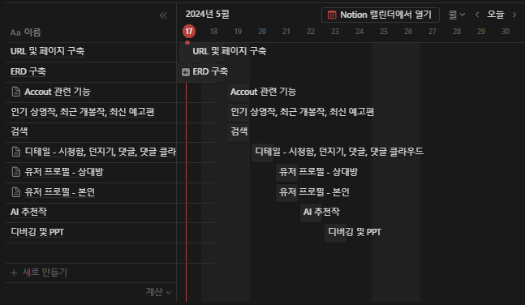
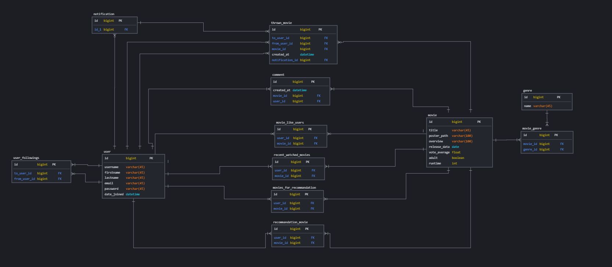

# 10-PJT

## 프로젝트 JENY

### 영화 추천 알고리즘 기반 커뮤니티 서비스
- 개발도구
  - Python 3.9.x
  - Django 4.2.x
  - Node.js LTS
  - Vue 3

- 개발 환경
  - Django REST framework & Vue

- 필수 요구사항
  1. 영화 데이터
    - 영화 정보 데이터는 최소 50개 이상 존재해야 함
    - fixtures를 사용하여 언제든 load 될 수 있는 초기 데이터가 있어야 함
  2. 영화 추천 알고리즘
    - 사용자는 반드시 최소 1개 이상의 영화를 추천 받을 수 있어야 함
    - 추천 방식은 자유롭게
    - 어떠한 방식으로 추천 시스템을 수현했는지 기술적으로 설명 가능해야 함
  3. API
    - 사용제한 없음
  4. 커뮤니티
    - 유저 간 소통할 수 있는 커뮤니티 기능 구현
    - 커뮤니티 기능은 반드시 게시판 형식일 필요는 없으며, "소통"이라는 관점 안에서 다양한 방법으로 자유롭게 구현 가능
  5. README
    1. 팀원 정보 및 업무 분담 내역
    2. 목표 서비스 구현 및 실제 구현 정도
    3. 데이터베이스 모델링 (ERD)
    4. 영화 추천 알고리즘에 대한 기술적 설명
    5. 핵심 기능에 대한 설명
    6. 기타 (느낀점, 후기 등)
    7. 배포 서버 URL (배포했을 경우)
  6. 기타
    - 최소한 5개 이상의 URL 및 페이지를 구성
    - Django REST framework를 사용하는 경우 사용자 요청에 따라 적절한 HTTP response status code를 응답해야 함
    - .gitignore 파일을 추가하여 불필요한 파일 및 폴더는 제출하지 않음
    - 필수 요구사항 외 추가 기능 및 반응형 디자인 등은 자유롭게 수행

## 회고
### 1일차

#### 기획

- Home
  - navbar -> 항상 고정 (App.view에 존재)
  - navbar를 제외한 밑 부분은 RouterView로 하위 컴포넌트가 존재
  - 제일 밑 부분에 footer 존재 (개별 컴포넌트)
  - navbar에 알림 기능 추가 -> 알림 데이터베이스 필요
    - 누가 보냈는지 알아야하고, 누가 받았는지 알아야되기 때문
    - 근데 이걸 실시간으로 어떻게 확인하게 할 것인가?
    - beforeEach로 컴포넌트 변화가 일어날 때 알림도 반영되게?
    - 아니면 그냥 해도 실시간으로 반영이 되나?
    - 배포를 안한다면 로그아웃 로그인이 필요하기 때문에 상관없음

  - 메인 (하위 컴포넌트 1)
    - 현재 Top5 영화를 보여주는 회전목마 기능 (컴포넌트)
      - 버튼을 통해 넘어감
    - 나만의 추천 (여기부터)
    - AI 추천
    - 인기 상영작
    - 최근 개봉작 (여기까지 컴포넌트 구성은 동일, List 컴포넌트 하위에 Item 컴포넌트 존재)
      - 포스터, 영화 제목, 개봉일 등의 정보가 함께 표현
      - 스크롤로 넘어감
    - 최신 예고편 (여기는 List 컴포넌트 + Item 컴포넌트이지만 모달로 구성되어 클릭 시 모달과 함께 예고편 재생 가능)
      - 포스터x, 영화 제목과 동영상 함께 표현
      - 버튼이 아니라 스크롤로 넘어감

  - 검색 (하위 컴포넌트 2)
    - 검색 바 존재
    - 키워드를 포함한 영화 제목 검색
    - 영화 정보(컴포넌트)
      - 영화 포스터, 제목, 장르, 출연자, 연도, 러닝타임, 별점, 간단한 줄거리 함께 표현
  
  - 디테일 (하위 컴포넌트 3)
    - 미리보기 영상 -> 이건 모달이 아니라 그냥 바로 영상을 재생가능하도록
    - 제목, 연령, 평점, 개봉년도, 러닝타임, 장르, 시청함 버튼, 던지기 버튼 함께 존재
      - 시청함 버튼과 던지기 버튼이 여기에선 메인
      - 시청함 버튼 클릭으로 인해 유저가 시청한 영화 목록이 업데이트됨.
      - 이 작업으로 인해 추천 목록이 변경되게됨. 
      - 그럼 시청함 버튼 클릭, 시청안함버튼 클릭 이렇게 하면 목록이 계속 변하게되나? -> <b>이걸 조금 더 자세히 상의 필요</b>
      - 던지기 버튼은 팔로우한 상대방에게 던지는 것
      - 버튼을 클릭하면 팔로우한 사람 목록이 나오고 그 사람 클릭 시 영화를 던짐

    - 콘텐츠 정보, 댓글, 댓글 클라우드 -> 라우터 링크로 구현
    - 줄거리
    - 감독 / 출연 배우 -> 프로필과 이름, 나이 등 간단한 정보 표현

    - 댓글
      - 그냥 간단하게 작성자의 이름과 댓글 내용을 목록으로 보여줌

    - 댓글 클라우드
      - 댓글을 기반으로 워드 클라우드를 만들어 영화에 대해 어떤 반응, 어떤 댓글이 가장 많이 보였는지 한 눈에 보여주도록 구현

  - 유저 프로필 (하위 컴포넌트 4)
    - 기본적으로 유저 정보 필요
    - 본인이냐 아니냐에 따라 서로 다른 정보가 페이지에 보여짐
      - 본인이라면
        - 유저 정보 부분에 팔로우 / 언팔로우 버튼이 없음
        - 프로필 수정 버튼이 있음
        - 프로필 수정 버튼 클릭 시 이름과 간단한 소개를 수정할 수 있어야함.
        - 기존에 쓰여있던 이름과 간단한 소개는 그대로 표현될 수 있도록 데이터를 같이 가져와야함.
        - 던진영화, 던짐 받은 영화, 최근 시청한 영화, 마음에 들어 한 영화를 각각의 컴포넌트로 표현
        - 장르 선호 -> 어떤 장르를 선호하는지 유저 시청 기록과 선호하는 장르 선택 리스트를 파악 후 워드 클라우드로 보여줌

      - 본인이 아니라면
        - 프로필 수정 버튼이 없으며 팔로우 / 언팔로우 버튼이 있음
        - 둘 다 재밌게 본 영화를 띄워줌. 
        - 마음에 들어 한 영화, 장르선호는 위와 동일하게 표시

  
- 대략적인 일정  

### 2일차
#### ERD 구축 및 models 작성

### 3일차
#### models 마무리 및 초기 데이터 수집

- models 확립 및 초기 데이터 수집
  - genres
    - tmdb의 gernes 데이터 수집
    - 장르를 가져오는 url은 getGenres/로 접근 가능

  - movies
    - tmdb의 popular 기준 1페이지부터 500페이지까지 약 10000개의 데이터 수집
    - 1페이지에 약 20개의 영화 데이터 존재
    - 단, release date나 poster path가 존재하지 않는 경우 데이터를 제외시킴.
    - runtime이 존재하지 않는 경우 0으로 설정
    - 영화를 가져오는 url은 getMovies/로 접근 가능

### 4일차
#### 인기 상영작, 최근 개봉작, 최신 예고편

- 고민
  - 위 세 개의 영화들을 사용자에게 보여줄 때 우리의 Movie 데이터베이스에서 보여줄 것인가 api를 연결할 것인가?
    - 우리 데이터베이스에 약 10000개의 초기 데이터가 들어있지만, 모든 영화데이터가 들어있는 것은 아님
    - 특히 검색 시에 실제로는 존재하는데 우리 데이터베이스에 존재하지 않아 검색되지 않는 경우 발생가능
    - 그런 오류를 없애기 위해 api를 연결하는 것이 맞을 것 같다.

  - 그렇다면 api를 프론트에 연결할 것이냐 백에 연결할 것이냐
    - 둘 다 가능
    - api와 연결하는 부분이 굳이 백에 있어야하나? 어차피 간단히 영화 데이터를 보여주기만 할 것이면 한 단계를 더 거치지 않고 프론트에서 api를 연결하는 것이 더 낫지 않나?
    - api에서 오류가 발생하거나 통신이 잘 이루어지지 않을 경우 백에서 예외처리를 해주는 것이 맞지 않나? 예를 들면 api 통신이 원활하지 않아서 인기 영화를 출력하지 못하는 상황에서 우리 db에 저장되어있는 데이터 10000개 중 인기 영화를 출력해주면 api 오류에 대한 예외처리를 해결해줄 수 있다.
  
  - 결론 -> ?? 프론트에서??

- 데이터를 불러오는 과정에서 의견 차이
  - 지응 : TBDM에서 영화 데이터가 업데이트 되는 것을 어떻게 반영할것인지?
    - API가 동작하지 않는 상태에서 catch > backend로 데이터 받아와야 한다.  
      데이터를 매번 요청해서 받아쓰기에는 API 가용 범휘 한계, 속도  
  - 남용 : 우리가 저장해놓은 데이터에서 가져다 쓰자 (일시적인 해결책)
    - 의견 조율 : API에 문제가 생기는 예외가 발생했을떄는 DB에 저장되어있는 데이터를 쓰자.
  
- 역할분담
  - 남용 : Word Cloud 구현 (~5/20)
  - 지응 : Vue 기본 컴포넌트 설계 및 Django 기본 url 설계 (~5/20)

### 5일차
#### WordCloud 기능 구현
- 목표
    - 사람들이 작성한 댓글을 한 눈에 볼 수 있는 WordCloud 기능 구현

- 더미데이터 생성
    - 아직 댓글기능이 구현되지 않았기 때문에 더미 댓글 데이터 50개 생성
    - 주소로 요청을 보내면 임의의 댓글 50개를 생성
    - GPT를 통해 더미데이터 생성    
        - path('getDummyComment/', views.getDummyComment)
        - user_id와 movie_id를 임의로 지정해주고 (1, 5) 5번영화에 1번 유저가 남긴 댓글 50개 작성 (get_or_create) 사용
- 불용어 선택
    - '은', '는', '이', '가', '했다', '했었다', '좋았다' 와 같은 의미가 없는 불용어 제거
    - 불용어가 제거된 키워드 개수를 세고 가중치를 구해서 글씨 크기와 색상에 변화를 줌
- 사용 라이브러리
    - vuewordcloud
    - krwordrank

- 참고 사이트
    - https://sunshower99.tistory.com/12 (블로그)
    - https://www.npmjs.com/package/vuewordcloud (공식문서)
